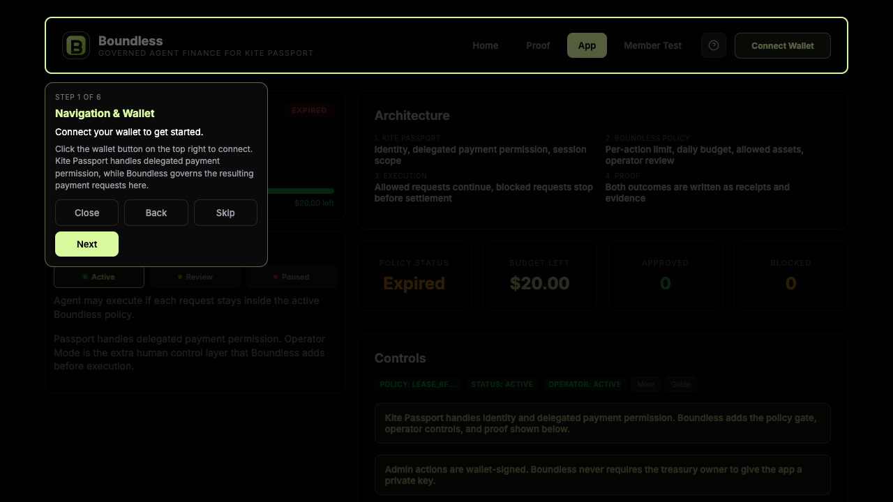
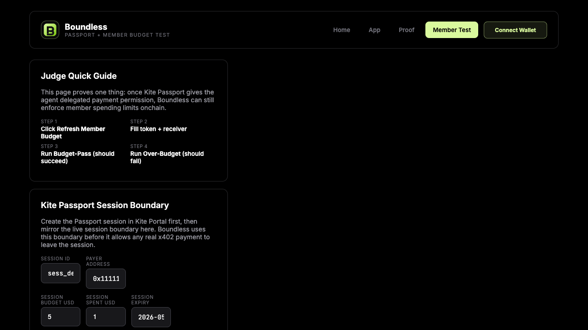
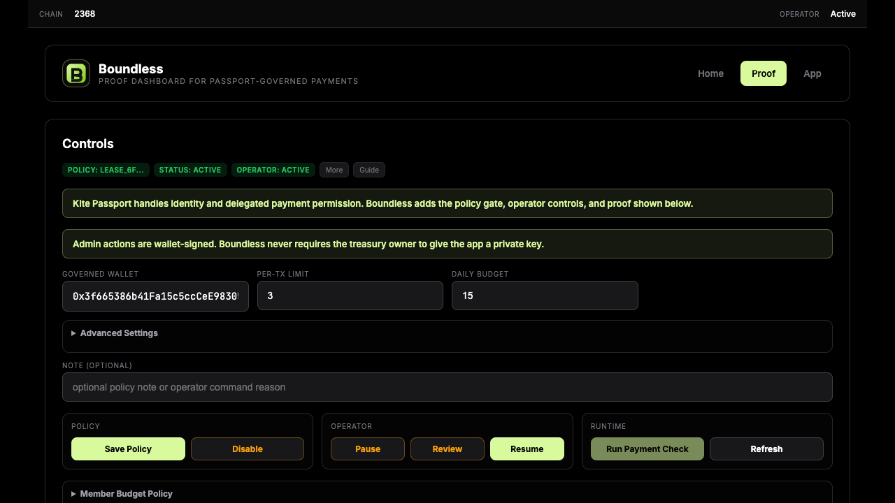
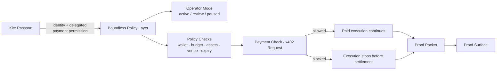
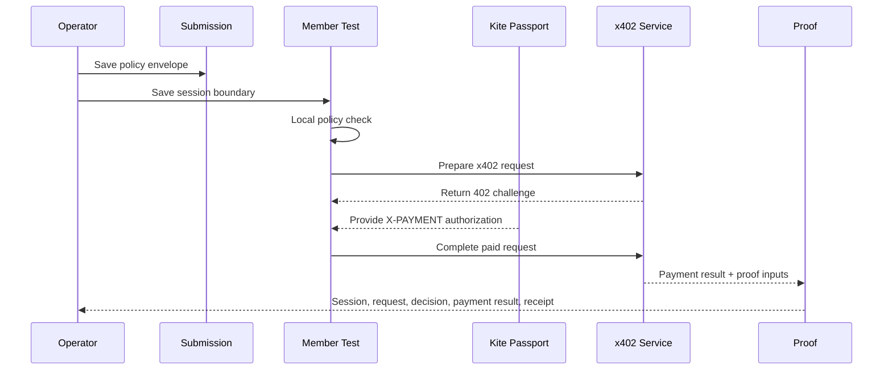

# Boundless




**Governed agent finance for Kite Passport.**

Boundless is the control layer between agent intent and real-money execution. Kite Passport handles delegated payment permission and session scope. Boundless adds the missing runtime layer: policy, operator controls, and proof.

## 30-Second Pitch

Agentic payments need more than a wallet and a session.

They need a way to answer:

- should this exact request execute now
- under this budget
- on this venue
- under this operator posture
- with evidence preserved after the decision

Boundless does that.

It lets a human define the policy envelope first:

- governed wallet
- per-transaction limit
- daily budget
- allowed assets
- allowed protocols
- operator mode
- expiry

Only requests that stay inside that envelope continue. The product writes proof for both approved and blocked outcomes.

## For Judges

| Item | Link / Value |
|---|---|
| Live demo | [unboundai.xyz](https://unboundai.xyz) |
| Operator surface | [unboundai.xyz/submission](https://unboundai.xyz/submission) |
| Member flow | [unboundai.xyz/member-test](https://unboundai.xyz/member-test) |
| Proof surface | [unboundai.xyz/proof](https://unboundai.xyz/proof) |
| Repository | [boundlessait/boundlessai](https://github.com/boundlessait/boundlessai) |
| Presentation deck | [deliverables/boundless-kite-hackathon-deck.pptx](deliverables/boundless-kite-hackathon-deck.pptx) |
| Submission form answers | [docs/SUBMISSION_FORM_ANSWERS.md](docs/SUBMISSION_FORM_ANSWERS.md) |
| Demo script | [docs/DEMO_VIDEO_SCRIPT.md](docs/DEMO_VIDEO_SCRIPT.md) |
| Latest bundled proof packet | [examples/live-proof-latest.json](examples/live-proof-latest.json) |
| Proof architecture notes | [docs/ARCHITECTURE.md](docs/ARCHITECTURE.md) |
| Current governed wallet | `0x3f665386b41Fa15c5ccCeE983050a236E6a10108` |
| Current policy envelope | `USDT` base asset, `$5` per-tx, `$20` daily budget, protocols `x402` / `mcp` |
| Current demo chain | `KiteAI Testnet` (`2368`) |

## Scorecard

| Judging dimension | Evidence in this repo |
|---|---|
| Track fit | Boundless is the runtime control layer that sits before autonomous trading or payment execution. It narrows delegated authority into explicit budgets, policy, and operator review. |
| Product completeness | Three deployed product surfaces, wallet-signed policy actions, session boundary capture, payment-check flow, and proof rendering are all shipped. |
| Technical execution | Next.js app, contract-backed control route, Kite chain config, x402 request flow, proof packet generation, and reproducible deck assets. |
| Proof quality | The repo includes screenshots, the latest proof packet, policy JSON, live routes, and a presentation deck generated from the live app state. |
| Differentiation | Kite Passport answers who can pay. Boundless answers whether this exact request should continue under the active human-defined rules. |

## Live Proof Snapshot

The latest bundled proof packet in this repo was generated on **2026-05-15 05:46:35 UTC** and reflects the current live policy envelope.

| Field | Value |
|---|---|
| Lease ID | `lease_ec5391c6-4cf5-4032-a926-0c7905fb3fc5` |
| Consumer | `bound-agent` |
| Governed wallet | `0x3f665386b41Fa15c5ccCeE983050a236E6a10108` |
| Base asset | `USDT` |
| Allowed protocols | `x402`, `mcp` |
| Allowed actions | `buy`, `sell`, `rebalance` |
| Per-tx budget | `$5` |
| Daily budget | `$20` |
| Chain | `KiteAI Testnet` (`2368`) |
| Latest outcome | `block` |
| Latest rationale | `No delegated payment request met the active Boundless policy in this Passport session.` |
| Proof packet | [examples/live-proof-latest.json](examples/live-proof-latest.json) |

The latest bundled packet is intentionally honest: after the most recent policy refresh, the request did not cross the configured threshold, so the decision stayed blocked. The product and recorded demo still show the full allow-path flow: save policy, mirror session boundary, prepare request, complete paid request, and open proof.

## Screenshots

### Submission / Operator Surface


### Member Test



### Proof Surface



## Architecture



## Runtime Flow



## What Makes It Different

| Approach | What it gives you | What it misses |
|---|---|---|
| Wallet access only | A wallet that can sign or pay | No runtime decision about whether this exact request should execute |
| Kite Passport only | Delegated payment permission and session scope | No per-request policy gate, operator pause/review, or explicit pass/fail proof layer |
| Monitoring dashboard only | Visibility after the fact | No pre-execution control |
| **Boundless** | Delegation + policy + operator posture + proof | The missing runtime governance layer between session permission and settlement |

## Product Surfaces

### `/submission`

- wallet-signed policy actions
- governed wallet, per-tx, and daily budget controls
- operator modes: `active`, `review`, `paused`
- current policy status and budget snapshot

### `/member-test`

- mirror Kite Passport session budget and expiry
- prepare a real x402 request
- run local policy checks before execution continues
- complete the paid request and open proof

### `/proof`

- show session boundary
- show request and decision
- show payment result
- show the receipt / evidence chain in one surface

## Repository Map

```text
app/
  api/control/route.ts              # wallet-signed policy actions
  api/passport-session/route.ts     # save Kite session boundary
  api/x402-payment/route.ts         # local policy check + x402 flow
  api/demo-x402-weather/route.ts    # demo relay for weather-style x402 requests
  submission/page.tsx
  member-test/page.tsx
  proof/page.tsx

components/
  submission-page.tsx
  member-test-page.tsx
  proof-page.tsx
  operator-console.tsx

lib/
  chain-config.ts                   # Kite mainnet/testnet config
  kite-passport-session.ts          # persisted session boundary model
  proof-artifacts.ts                # proof packet writes
  site-data.ts                      # merge current proof/controller/runtime data
  trust-lease-controller.ts         # controller reads/writes

contracts/
  contracts/                        # controller and vault contracts
  test/                             # guardrail tests

data/trust-leases/
  live-proof-latest.json            # latest proof packet
  leases/active-lease.json          # current policy envelope
  proof-dashboard.html              # rendered proof surface snapshot

docs/
  SUBMISSION_FORM_ANSWERS.md
  DEMO_VIDEO_SCRIPT.md
  ARCHITECTURE.md
  SCORING_ALIGNMENT.md

deliverables/
  boundless-kite-hackathon-deck.pptx
```

## Local Run

```bash
npm install
npm run dev
```

Open:

- `http://localhost:3000/submission`
- `http://localhost:3000/member-test`
- `http://localhost:3000/proof`

## Validation

```bash
npm run check
npm run build
```

Contract checks:

```bash
npm run contracts:test
```

## Submission Package

- Judge README: [README.md](README.md)
- Presentation deck: [deliverables/boundless-kite-hackathon-deck.pptx](deliverables/boundless-kite-hackathon-deck.pptx)
- Submission answers: [docs/SUBMISSION_FORM_ANSWERS.md](docs/SUBMISSION_FORM_ANSWERS.md)
- Demo script: [docs/DEMO_VIDEO_SCRIPT.md](docs/DEMO_VIDEO_SCRIPT.md)
- Live proof packet: [examples/live-proof-latest.json](examples/live-proof-latest.json)

## Final Claim

**Kite Passport lets the agent pay. Boundless decides the exact rules under which that payment is allowed.**
